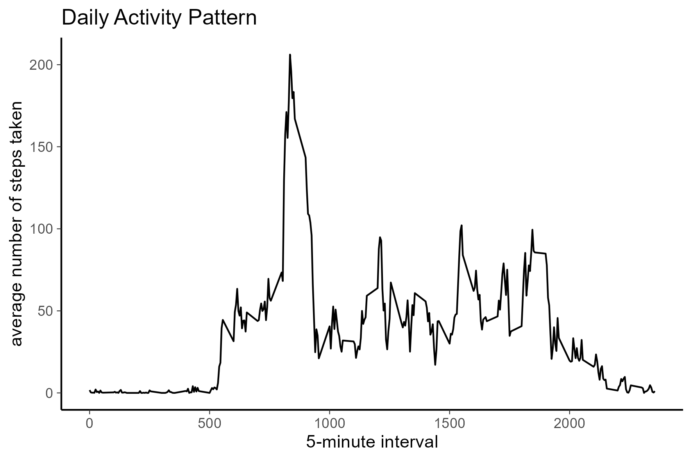
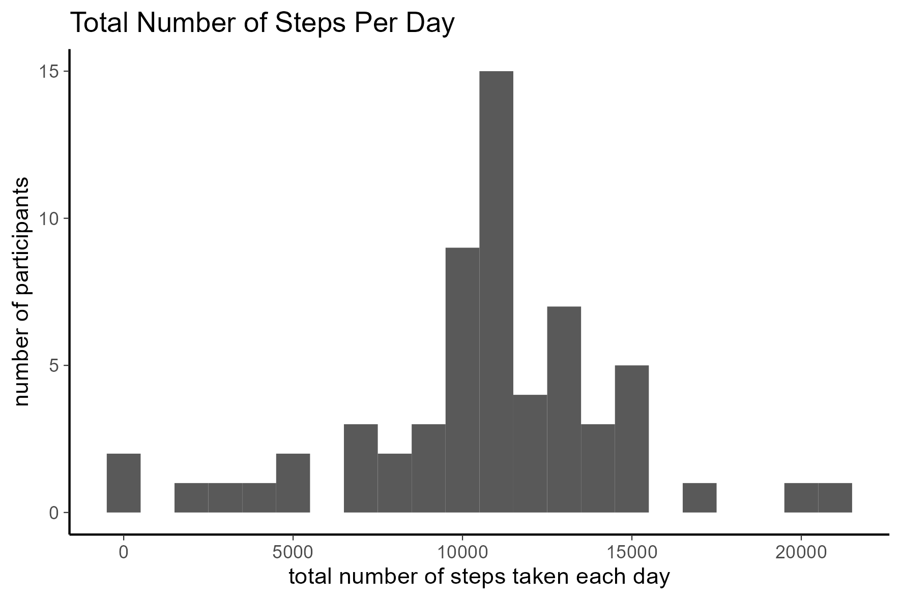
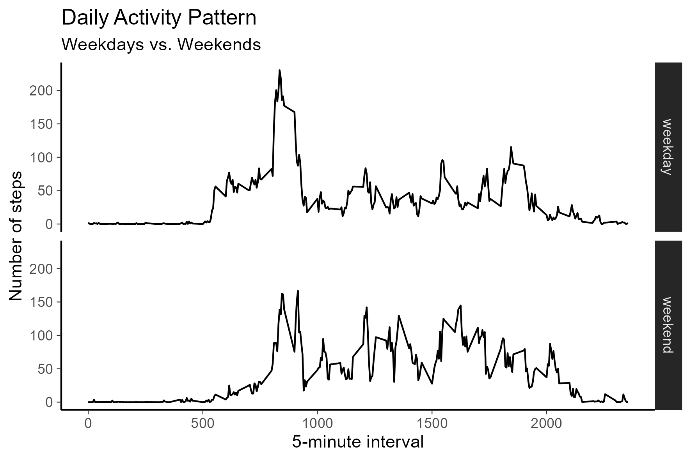

knitr::opts_knit$set(root.dir = 'C:/Users/sgras/OneDrive/Documents/School/WNTR 2024/Reproducible Research/Week2/Assignment/RepData_PeerAssessment1')

## Setup

```r
library(tidyverse)
```

```
## ── Attaching core tidyverse packages ──────────────────────── tidyverse 2.0.0 ──
## ✔ dplyr     1.1.4     ✔ readr     2.1.5
## ✔ forcats   1.0.0     ✔ stringr   1.5.1
## ✔ ggplot2   3.5.0     ✔ tibble    3.2.1
## ✔ lubridate 1.9.3     ✔ tidyr     1.3.1
## ✔ purrr     1.0.2     
## ── Conflicts ────────────────────────────────────────── tidyverse_conflicts() ──
## ✖ dplyr::filter() masks stats::filter()
## ✖ dplyr::lag()    masks stats::lag()
## ℹ Use the conflicted package (<http://conflicted.r-lib.org/>) to force all conflicts to become errors
```


## Loading and preprocessing the data


```r
data <- read.csv("activity.csv")
```

## What is mean total number of steps taken per day?

<!-- -->


```r
total.steps <- tapply(data$steps, data$date, FUN=sum, na.rm=TRUE)

Steps_hist <- qplot(total.steps, binwidth=1000, xlab="total number of steps 
                taken each day", ylab = "number of participants", main = "Total Number of Steps Taken Per Day") +
        theme_dark() +
        theme(panel.grid.major = element_blank(), panel.grid.minor = element_blank(),
        panel.background = element_blank(), axis.line = element_line(colour = "black"))
```

```
## Warning: `qplot()` was deprecated in ggplot2 3.4.0.
## This warning is displayed once every 8 hours.
## Call `lifecycle::last_lifecycle_warnings()` to see where this warning was
## generated.
```

```r
mean(total.steps, na.rm=TRUE)
```

```
## [1] 9354.23
```

```r
median(total.steps, na.rm=TRUE)
```

```
## [1] 10395
```

## What is the average daily activity pattern?

<!-- -->


```r
averages <- aggregate(x=list(steps=data$steps), by=list(interval=data$interval),
                      FUN=mean, na.rm=TRUE)

ActivityPattern <- ggplot(data=averages, aes(x=interval, y=steps)) +
        geom_line() +
        xlab("5-minute interval") + 
        ylab("average number of steps taken") +
        labs(title = "Daily Activity Pattern") +
        theme_dark() +
        theme(panel.grid.major = element_blank(), panel.grid.minor = element_blank(),
                panel.background = element_blank(), axis.line = element_line
                (colour = "black"))
```

On average across all the days in the dataset, the 5-minute interval contains
the maximum number of steps?

```r
averages[which.max(averages$steps),]
```

```
##     interval    steps
## 104      835 206.1698
```

## Imputing missing values

There are many days/intervals where there are missing values (coded as `NA`). 
The presence of missing days may introduce bias into some calculations or 
summaries of the data.


```r
missing <- is.na(data$steps)
# How many missing
table(missing)
```

```
## missing
## FALSE  TRUE 
## 15264  2304
```

All of the missing values are filled in with mean value for that 5-minute
interval.


```r
# Replace each missing value with the mean value of its 5-minute interval
fill.value <- function(steps, interval) {
    filled <- NA
    if (!is.na(steps))
        filled <- c(steps)
    else
        filled <- (averages[averages$interval==interval, "steps"])
    return(filled)
}

filled.data <- data
filled.data$steps <- mapply(fill.value, filled.data$steps, filled.data$interval)
```
Now, using the filled data set, let's make a histogram of the total number of 
steps taken each day and calculate the mean and median total number of steps.

<!-- -->


```r
total.steps <- tapply(filled.data$steps, filled.data$date, FUN=sum)
AdjSteps_hist <- qplot(total.steps, binwidth=1000, xlab="total number of steps taken each day", 
      ylab = "number of participants", main = "Total Number of Steps Per Day") +
        theme_dark() +
        theme(panel.grid.major = element_blank(), panel.grid.minor = element_blank(),
        panel.background = element_blank(), axis.line = element_line(colour = "black"))

mean(total.steps)
```

```
## [1] 10766.19
```

```r
median(total.steps)
```

```
## [1] 10766.19
```

Mean and median values are higher after imputing missing data. The reason is
that in the original data, there are some days with `steps` values `NA` for 
any `interval`. The total number of steps taken in such days are set to 0s by
default. However, after replacing missing `steps` values with the mean `steps`
of associated `interval` value, these 0 values are removed from the histogram
of total number of steps taken each day.

Additionally there is less of a negative skew. The median and mean match now 
whereas before the median was higher than the mean indicating that there were 
values "pulling" the mean score lower. 

## Are there differences in activity patterns between weekdays and weekends?
First, we have to identify the days of the week for each datapoint. In
this part, we use the dataset with the filled-in values because it is more
representative of reality.


```r
weekday.or.weekend <- function(date) {
    day <- weekdays(date)
    if (day %in% c("Monday", "Tuesday", "Wednesday", "Thursday", "Friday"))
        return("weekday")
    else if (day %in% c("Saturday", "Sunday"))
        return("weekend")
    else
        stop("invalid date")
}
filled.data$date <- as.Date(filled.data$date)
filled.data$day <- sapply(filled.data$date, FUN=weekday.or.weekend)
```

The following plot compares th weekday and weekend daily activity pattern by 
using the above code to identify first, the category of the data point and then 
mapping it to the appropriate graph. 

<!-- -->


```r
averages <- aggregate(steps ~ interval + day, data=filled.data, mean)
ActivityPattern_comp <- ggplot(averages, aes(interval, steps)) + geom_line() + facet_grid(day ~ .) +
    xlab("5-minute interval") + ylab("Number of steps") +
        labs(title = "Daily Activity Pattern", subtitle = "Weekdays vs. Weekends")+
        theme_dark() +
        theme(panel.grid.major = element_blank(), panel.grid.minor = element_blank(),
        panel.background = element_blank(), axis.line = element_line(colour = "black"))
```

## Printing and saving
This final section is purely to demonstrate how I saved all of these into the 
working directory so i could refer to them in the assignment. 


```r
ggsave(filename = "Total_Steps_Hist.png", 
       device = "png",
       height = 10, width = 15, units = "cm", 
       plot = Steps_hist, path = "PA1_template_figures")

ggsave(filename = "Activity_Pattern.png", 
       device = "png",
       height = 10, width = 15, units = "cm", 
       plot = ActivityPattern, path = "PA1_template_figures")

ggsave(filename = "Adjusted_Total_Steps_Hist.png", 
       device = "png",
       height = 10, width = 15, units = "cm", 
       plot = AdjSteps_hist, path = "PA1_template_figures")

ggsave(filename = "Activity_Pettern_Comparison.png", 
       device = "png",
       height = 10, width = 15, units = "cm", 
       plot = ActivityPattern_comp, path = "PA1_template_figures")
#Once these are saved I can refer to them in the actual code using "<!-- -->"
```


